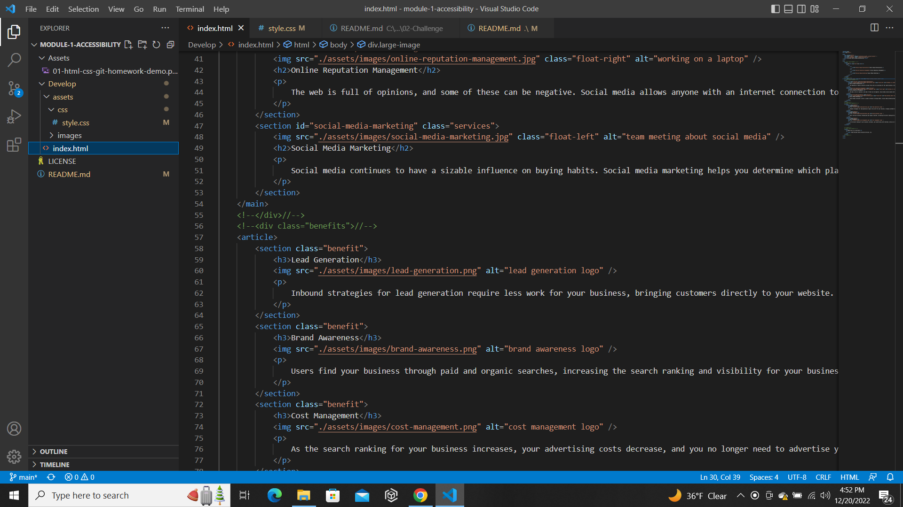

# module-1-accessibility
Changes made to code

# HTML

Changed non semantic tags such as div and span to semantic tags header, main, section, footer, nav, aside, em.  

Added functionality to nav to have page redirect when clicking "Search engine optimization.  

# CSS

Consolidated benefit classes to a single class because they all had the same attributes.  

Consolidated main classes to single class called services because they all had the same attributes.  

Changed the element tags to match what I changed in HTML.  

#Screenshot

